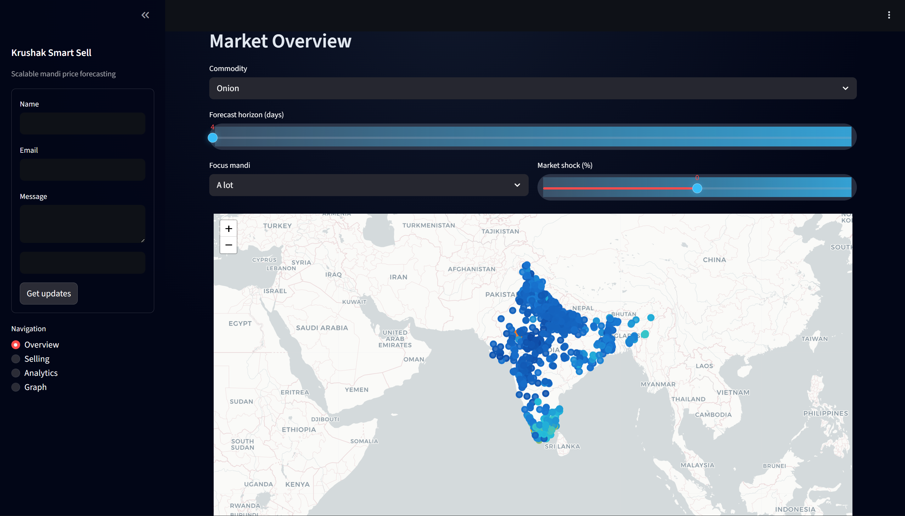
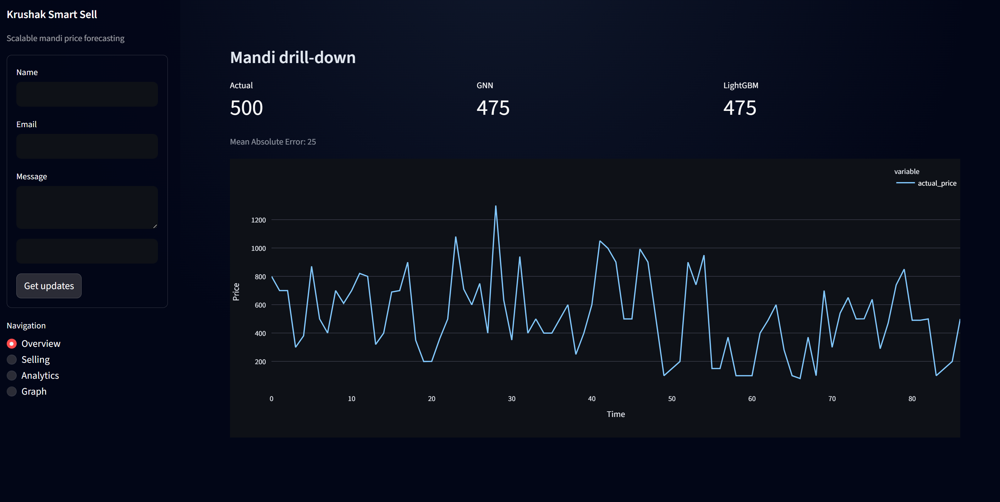
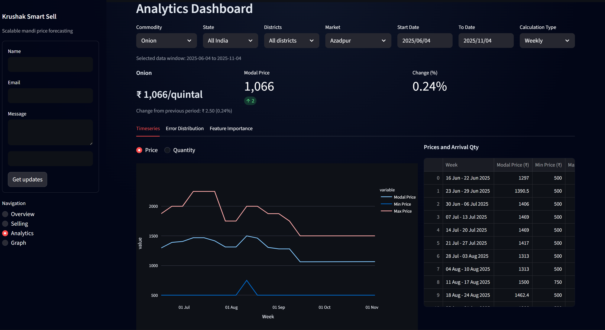
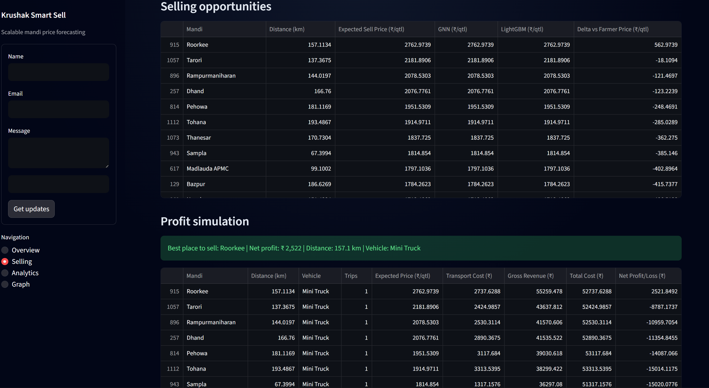
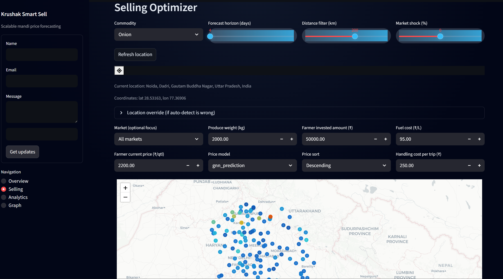

# Krushak SmartSell

A graph-native command center that helps agri-enterprises decide **where to buy, how much to move, and what to sell** in minutes instead of weeks. Krushak SmartSell fuses mandi transactions, logistics constraints, and weather signals into a unified knowledge graph so planning, procurement, and fulfillment stay aligned around trustworthy forecasts.

---

## Why it matters
- **₹5.5B+ trade visibility**: link every mandi, crop, and buyer into one consistent dataset.
- **Actionable predictions**: deploy GNN + time-series hybrids for market-level price & supply forecasts.
- **Ops-ready UX**: command bar, natural language actions, and graph explorer keep teams in flow.
- **Enterprise guardrails**: role-based workspaces, audit-ready decisions, and privacy-first deployment.

## Platform highlights
1. **Live Control Tower** – Monitor price spreads, supply shocks, and fulfillment risk with streaming cards.
2. **Optimizer Assist** – Let the command palette run scenarios ("Show me profitable onion lanes in MP").
3. **Graph Explorer** – Traverse crop → mandi → buyer relationships with geospatial overlays.
4. **Execution Hub** – Push decisions to sourcing, transport, and sales squads with context-preserving notes.

## Graph-powered intelligence
- **Multi-relational graph** capturing mandi adjacency, logistics corridors, demand clusters, and trader behavior.
- **Model stack** blends LightGBM residuals, attention-based GNNs, and classical baselines for stability.
- **Feature store** tracks lagged signals, rolling market stats, and curated agronomy indicators per node.
- **Explainability layer** surfaces dominant contributors (weather, arrivals, route health) for every prediction.

## Modeling sketch
$$
y_{t+h} = f_\theta\big(G_t, X_t, \text{rolling}(X), \text{market\_context}\big) = \underbrace{\mathrm{GNN}(G_t, X_t)}_{\text{spatial lift}} + \underbrace{\mathrm{TS}(X_t)}_{\text{temporal baseline}}
$$

## Tech stack
- **Frontend**: Next.js + React, Tailwind primitives, framer-motion micro transitions, custom command palette.
- **Data + Modeling**: PyTorch Geometric, LightGBM, pandas, NumPy, DuckDB, on-demand Optuna tuning.
- **Pipelines**: Prefect orchestration, dbt-style transforms, GitHub Actions for sanity + artifact promotion.
- **Infra**: Azure Container Apps, Redis Streams, Postgres/Neon, S3-compatible cold storage.

## Product modules
| Module | What it solves | Key surfaces |
| --- | --- | --- |
| Procurement Intelligence | Detect buying spikes, scarcity, and arbitrage windows | Metric cards, anomaly ribbons, chatbot follow-ups |
| Graph Explorer | Understand mandi-buyer connectivity + risk | Interactive network canvas, geography layers, time scrubbing |
| Ops Notebook | Share the why behind every move | Markdown + data blocks, task routing, alert comments |
| Marketplace Console | Track committed vs available supply | Lane matrix, fulfillment SLA tracker, residual monitor |

## Outcomes delivered
- **20% faster** weekly planning thanks to reusable scenario templates.
- **8-12% margin lift** on monitored commodities by catching inter-mandi spreads early.
- **>90% adoption** inside sourcing teams due to natural-language workflows and lightweight approvals.

## Screenshot tour

| | |
| --- | --- |
|  |  |
|  |  |
|  |  |
|  |  |

## Get involved
- **See it live**: [krushak.app](https://krushak.app)
- **Questions / pilots**: write to hello@krushak.app
- **Enterprise rollouts**: tailored deployments on your virtual network with managed model updates.

> _This repo intentionally stays light—reach out if you need the private deployment notes, infrastructure modules, or playbooks tailored to your org._
